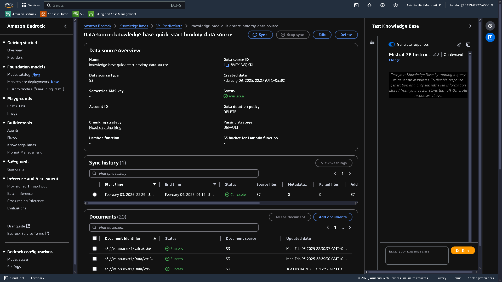
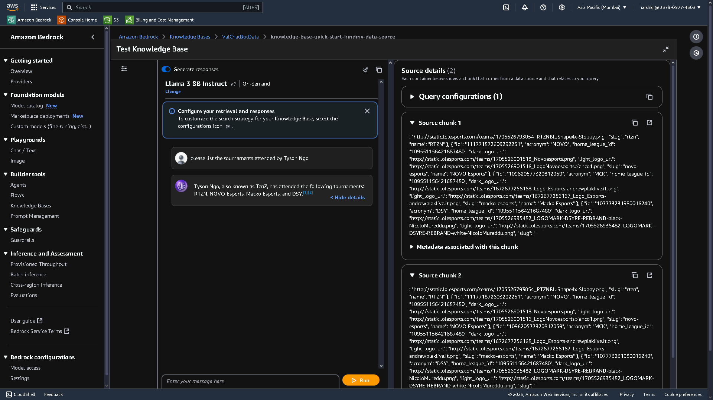
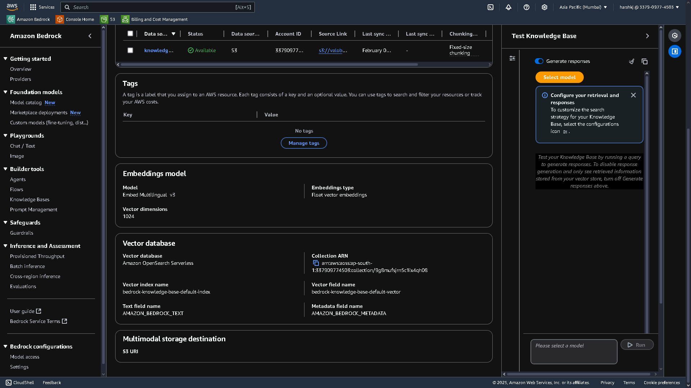

#  LLM-Powered Digital Assistant | AWS Bedrock

## 🚀 Project Overview
This project is an advanced **LLM-powered digital assistant** designed to analyze **Valorant Esports players** and assist in **role-based team formation**. Built using **Amazon Bedrock**, it leverages **retrieval-augmented generation (RAG)** to fetch real-time stats and match data.

## 🛠️ Features
- 🔍 **Player Analysis**: Evaluates player performance and suggests suitable roles.
- 📊 **Real-time Data Retrieval**: Uses **RAG** for fetching the latest match data and statistics.
- 🖥 **Web Scraping**: Aggregates training data from multiple online sources.
- 🔧 **Amazon Bedrock Integration**: Provides scalable and efficient LLM hosting.
- 🏷 **Multilingual Embedding Model**: Utilizes **Embed Multilingual v3** for better understanding across languages.
- 🔄 **Chunking Process**: Implements **fixed-size chunking** with **500 tokens** and **5-token overlap** for improved context retention.

## 🏗 Architecture
```
1. Data Collection: Web Scraping for esports player stats.
2. Data Processing: Preprocessing and fine-tuning the LLM.
3. RAG Pipeline: Implemented on Amazon Bedrock with OpenSearch.
4. User Interaction: Flask-based UI for easy team formation and queries.
```

## 🖥️ Screenshots
📸 **Knowledge Base Data Source**  


📸 **Test Knowledge Base Query**  


📸 **Embedding Model & Vector Database**  



1. **Uploaded player stats & team data to S3**.
2. **Synced the data source in Amazon Bedrock**.
3. **Queried the assistant for team formation & player insights**.
4. **Retrieved recommendations based on role and performance**.

## 🎯 Future Improvements
- **Enhancing the LLM’s contextual understanding** with more training data.
- **Deploying a web-based UI** for better usability.
- **Expanding to other esports games** beyond Valorant.

